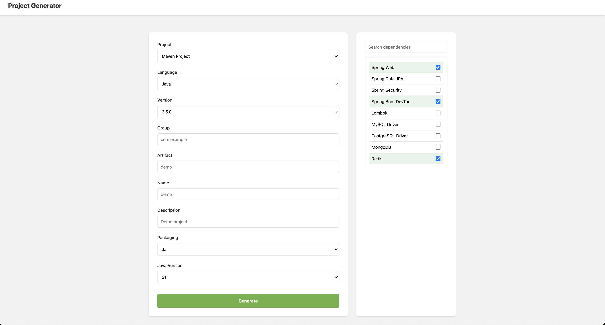

# Start.io - Gerador de Projetos Spring Boot

Uma interface web moderna e responsiva para gerar projetos Spring Boot, inspirada no [Spring Initializr](https://start.spring.io).



> Nota: Para adicionar uma imagem de preview do seu projeto, salve um screenshot da aplicação como `preview.png` no diretório `static/img/`.

## 🚀 Funcionalidades

- Interface moderna e responsiva
- Seleção de dependências com busca em tempo real
- Suporte para Maven e Gradle
- Múltiplas versões do Spring Boot (3.3.0 até 3.5.0)
- Suporte para diferentes linguagens (Java, Kotlin, Groovy)
- Configuração personalizada de grupo/artifact ID
- Seleção de versão Java
- Download direto do projeto em formato ZIP

## 🛠️ Tecnologias Utilizadas

- HTML5
- CSS3 (com variáveis CSS e design responsivo)
- JavaScript (Vanilla JS)
- Python (para servidor de desenvolvimento)
- Netlify (para deploy)

## 📦 Estrutura do Projeto

```
start-io/
├── static/
│   ├── css/
│   │   └── style.css
│   └── js/
│       ├── backend.js
│       └── config.js
├── index.html
├── server.py
├── netlify.toml
└── README.md
```

## 🚀 Como Executar

### Localmente

1. Clone o repositório:
```bash
git clone https://github.com/seu-usuario/start-io.git
cd start-io
```

2. Inicie o servidor Python:
```bash
python3 server.py
```

3. Acesse no navegador:
```
http://localhost:8080
```

### Deploy no Netlify

1. Faça fork deste repositório
2. Conecte sua conta do Netlify ao GitHub
3. Selecione o repositório para deploy
4. Configure o deploy com as seguintes configurações:
   - Build command: deixe em branco
   - Publish directory: `/`

## 💻 Desenvolvimento

Para desenvolvimento local, o projeto inclui um servidor Python que atua como proxy para o Spring Initializr, evitando problemas de CORS.

### Modificando o Projeto

- `static/css/style.css`: Estilos da aplicação
- `static/js/backend.js`: Lógica de interação e geração do projeto
- `static/js/config.js`: Configurações da API
- `index.html`: Estrutura da página
- `server.py`: Servidor de desenvolvimento com proxy
- `netlify.toml`: Configurações do Netlify

## 📝 Licença

Este projeto está sob a licença MIT. Veja o arquivo [LICENSE](LICENSE) para mais detalhes.

## 👥 Contribuindo

1. Faça um Fork do projeto
2. Crie uma branch para sua feature (`git checkout -b feature/AmazingFeature`)
3. Commit suas mudanças (`git commit -m 'Add some AmazingFeature'`)
4. Push para a branch (`git push origin feature/AmazingFeature`)
5. Abra um Pull Request

## ✨ Agradecimentos

- [Spring Initializr](https://start.spring.io) - Por fornecer a API que torna este projeto possível
- [Spring Boot Team](https://spring.io) - Pelo excelente framework 